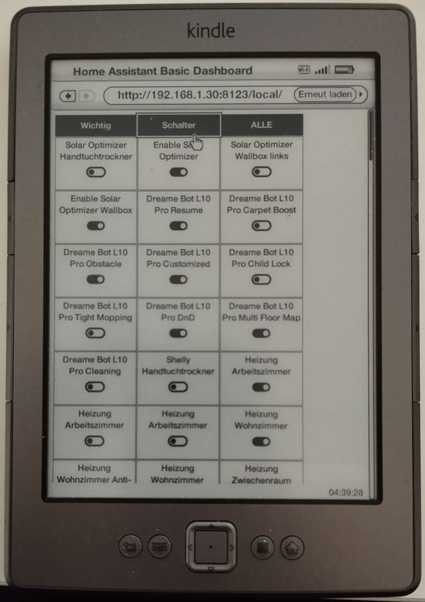

# Home Assistant Basic Dashboard

Basic Dashboard for Home Assistant meant to be shown on an Kindle device.



It should work with any [ES3](https://en.wikipedia.org/wiki/ECMAScript_version_history) compatible device (at least viewing) and was tested with [Kindle 4](https://en.wikipedia.org/wiki/Amazon_Kindle#Kindle_4). But it's much more useable with an illuminate touch device like [Kindle Paperwhite](https://en.wikipedia.org/wiki/Amazon_Kindle#Kindle_Paperwhite_(first_iteration)).

Loosely inspired by [KFloorP](https://github.com/viny182/kfloorp/) and [Hatki](https://github.com/tombo1337/hatki).

## Installation

Just deploy the content of the `dist` directory to any HTTP server and create a configuration.

The simplest way is to use Home Assistant's build in server at `.../config/www/BasicDashboard/`.
This one is reachable (if enabled) at <http:/127.0.0.1:8123/local/BasicDashboard/index.html>.

I'm using a git clone and a symlink to have a simple way for updates:
```sh
# install
git clone https://github.com/escoand/ha-basic-dashboard.git /path/to/local/clone
ln -s /path/to/local/clone/dist /path/to/config/www/BasicDashboard
# update
cd /path/to/local/clone
git pull
```

## Configuration

The configuration has to be in the file `config.json` located in the same directory as `index.html`.
The comments below are just for documentation and have to be removed - JSON actually doesn't allow comments.

```jsonc
{
    // URL to Home Assistant (optional, default URL of HTTP server)
    "base": "http://127.0.0.1:8123",
    // Long living access token from user settings
    "token": "...",
    // Time in milliseconds for refreshing the entitites (optional, default 1 min)
    "refresh": 10000,
    // List of floors or tabs
    "floors": {
        // Name of the floor or tab
        "Floor 1": [
            // Array of entities to show
            {
                // entity_id of the respective entity
                "entity_id": "sensor.my_sensor",
                // Attribute to show (optional, default state of entity)
                "attribute": "last_updated",
                // Unit of measurement (optional)
                "unit_of_measurement": "°C",
                // Name to show (optional, default name in HA)
                "name": "Custom name",
                // Service to call on click (optional)
                "service": "homeassistant.toggle",
                // Data to pass to service call (optional, any type of data)
                "service_data": { ... },
            }
        ],
        // Use string as regex to filter all entities
        "Switches": "^(switch|light)\\..*$",
        // Use null to show all entities
        "All": null
    }
}
```

## Troubleshooting

### Screensaver on Kindle Paperwhite

To disable the screensaver you can enter `~ds` in the search box on the home screen. To enable it again you have to restart the device.

### Separate HTTP server

If you want to use a separate HTTP server you've to setup the [CORS headers](https://www.home-assistant.io/integrations/http/#cors_allowed_origins).